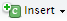
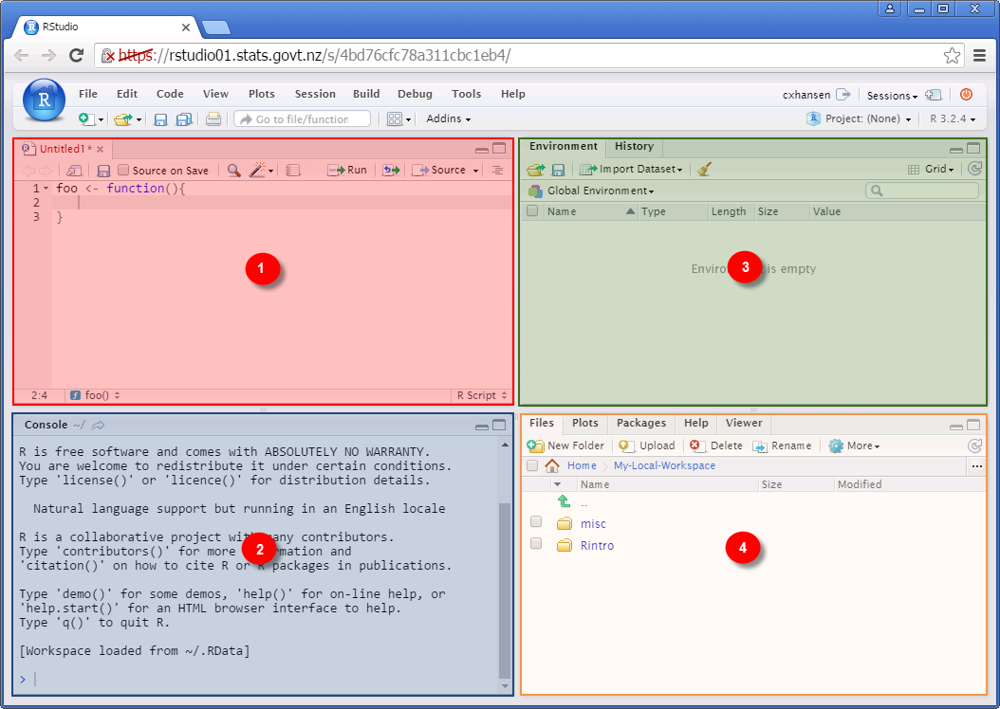
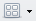
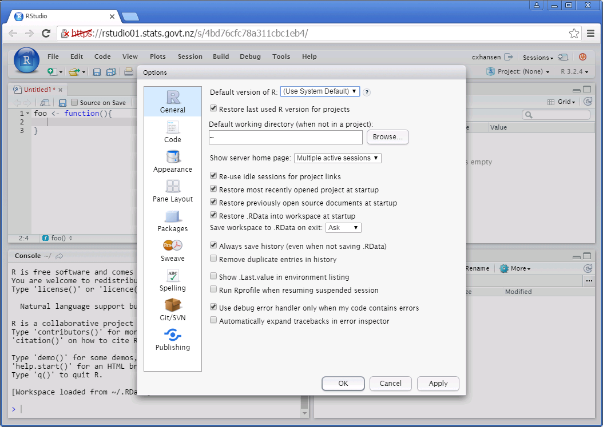
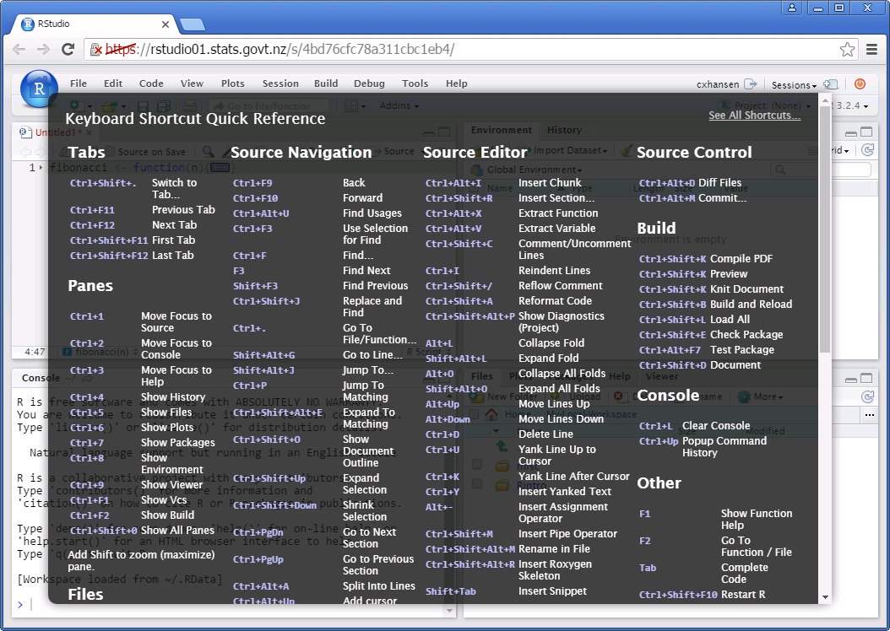
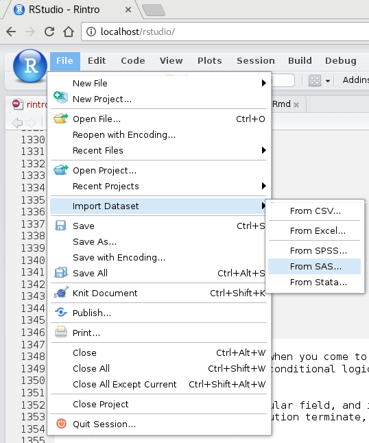

<style type=text/css>
.table th:not([align]){
  text-align: center;
}
img{
  margin-left: auto;
  margin-right: auto;
}
</style>

```{r setup, echo = FALSE}
knitr::opts_chunk$set(comment = NA, fig.align = "center", message = FALSE)
```


## R Markdown and R Notebooks

The material for these sessions is written in R Markdown.  R Markdown is a plain
text format which can be processed to produce nicely formatted output such as
HTML.  The point of these sessions is not to discuss R Markdown in any real
detail, but to learn R, so we won't dwell on it here.  That said, you will
likely get somewhat familiar with the syntax simply by working through this
document.

There are a number of different output types available when authoring with R
Markdown.  Here, we are using R Notebooks, or the `html_notebook` output style.
R Notebooks are useful because R code chunks can be inserted by users at any
point, and the code in those chunks can be executed independently and output
shown.  

Try it out.  Simply type CTRL+ALT+I to insert a new chunk right wherever the
cursor is positioned, or press the 'insert' () icon
positioned at the top of this pane.  Enter an R command or several commands and
click the 'play' (small green triangle at top-right of the code chunk,
) icon.  You can also edit the code in a chunk and re-evaluate
it on demand.

Of course, you can also enter commands at any time in the traditional console.


## Objectives

After today you will:

* be faimiliar with the RStudio IDE
* understand the basics of R's data frame type, among others
* be able to import data from external sources
* be able to do basic data manipulation
* understand plotting basics
* be able to produce basic reports with R Markdown
* be able to make a basic web application with R Shiny

We have a fair bit to cover, so coverage will be intentionally light at times.
Readers are encouraged to learn more about things independently as relevant.

```{r}
plot(AirPassengers)
summary(AirPassengers)
```


## RStudio Basics

RStudio is an integrated development environment (IDE) for writing and
executing R code. It is an open source product developed by RStudio Inc.

We will not cover many of the features in any real detail--there are simply too
many to talk about here and, the easiest way to learn about RStudio is probably
to just start using it.  RStudio Inc. also add new features regularly, so users
are encouraged to keep an eye on the [RStudio blog](https://blog.rstudio.org/).

### Accessing RStudio

While there are a number of ways of writing and executing code, using RStudio is
the recommended approach.  At Statistics New Zealand, RStudio runs on a Linux 
server, and is accessed in a web browser by visiting either of: 

[rstudio01.stats.govt.nz](rstudio01.stats.govt.nz)

or: 

[rstudio02.stats.govt.nz](rstudio02.stats.govt.nz)

RStudio is available to all, though a help desk request is still required.  This
is so the service center can keep track of the number of users, and also send an
[FAQ](http://tematapihi.stats.govt.nz/~/media/Intranet/Homepages/R%20User%20Group/doc/RStudio_FAQ.ashx?la=en)
to new users.

RStudio works better in modern browsers.  For that reason, it is recommended
that you use Google Chrome with RStudio, rather than Internet Explorer.


### General layout



Pane 1, the 'source' pane, consists of a tabbed layout containing documents
of various types such as R scripts, C source code files, markdown documents,
and so on.  This pane is only present if such documents are open.  If no
documents are open, pane 2 will expand to fill the space.

Pane 2, the 'console' pane, consists of the traditional interactive R
console.  In this window, the user can enter single R commands (or code blocks)
and execute them.  A command history is generally available for the user to
cycle through using the &uarr; / &darr; keys.

Panes 3 and 4 are customisable.  By default, pane 3 contains 'Environment'
and 'History' tabs; while pane 4 contains 'Files', 'Plots', 'Packages', 'Help',
and 'Viewer' tabs.  

The general layout of the panes is customisable, and users can collapse and
zoom in various ways.  Settings can be changed by selecting
Tools&rarr;Global Options..., then Pane Layout.  Alternatively, click the 
Workspace Panes button ().


### Customising RStudio

RStudio has a number of customisable features, and users should feel free to
experiment.  Most are found via Tools&rarr;Global Options... .



Otherwise, there are a large number of useful keyboard shortcuts.  Probably
the single most useful combination is CTRL + ENTER--when focus is on a source
window this results in the current line (or selection of lines) being executed
in the console.  Pressing SHIFT + ALT + K brings up a list of keyboard
shortcuts:




### Getting help

Traditionally, R users have launched the system help in a web browser by issuing
`help.start()`.  RStudio has a 'Help' tab visible by default, the contents of
which contain the traditional help, among other things.

Users can browse and search the help, and are encouraged to do so--R help pages
generally include runnable examples so are a good source for learning.  

If a user wants the help page for a particular function, `foo`, then a shortcut
is to issue `?foo` from the command line.  If `foo` belongs to a package which
is not yet loaded, its help can be accessed via `?packagename::foo`.  Try it
out:

```{r}
help.start()
?plot
??dplyr::summarise
```

More detailed documentation on RStudio than is presented here can be found
by selecting Help&rarr;RStudio Docs from the file menu.


## Miscellaneous

### Packages

R is made extensible by way of add-on packages.  To load a package called `foo`,
simply run:

```{r}
plot(AirPassengers)
```

```r
library(foo)
```

or 

```r
require(foo)
```

There are a large number of packages preinstalled and available to all.  If
a package you wish to use isn't present, you will be able to install it in 
your own personal package library.  

There are several sources for packages, but you will commonly get them from the
official Comprehensive R Archive Network (CRAN).  If you wish to install 
package `foo` from CRAN, simply run:

```r
install.packages('foo')
```

_**Please**_ do not install a package without checking it is available in the
site library first.  And if you want a package updated, please contact the 
service centre, rather than installing in your own personal library--it makes
sense for everybody to be using the same version of packages where possible.


### Case sensitivity

R is case sensitive, so users coming from languages such as SAS or Visual Basic
need to take special care.  `N` and `n` can happily coexist in R, for example,
as there is no ambiguity.

Note also that the server implementation of R runs on a Linux platform, and
Linux is sensitive to case in situations where Windows is not.  This is
particularly important for file and directory names.  For example, `blah.txt`
and `BLAH.TXT` are _not_ the same file when stored on a Linux filesystem and,
again, can happily coexist.


### Linux

The R servers are Linux-based, not Windows.  Linux and Windows are
fundamentally different operating systems, and the differences will occasionally
be visible to users.

Probably the most obvious difference is in the handling of file and directory
names.  In Linux, case sensitivity is important, as noted already.

In addition to this, directories are separated with forward slashes, `/`,
on a Linux platform, while in Windows they are separated by backslashes, `\`.
Actually, forward slashes can be used in R on any platform, and is the
recommended approach (a backslash is the so-called escape character, so using
forward slashes for paths is just easier).

Files and directories starting with a period are hidden and will usually not
be visible by default, exceptions being hidden files that relate to R such as
`.Renviron`.

Finally, drive letters are specific to Windows--there is no such thing as the
'C:' drive, for example.  On a Linux system, the root directory is `/`, and
every other file or directory is located somewhere below this.  That is, every
file can be accessed in the following form:

```asis
/folder_1/folder_2/.../folder_n/filename
```

Several conveniences also exist:`.` is the current directory, `..`' is the
directory below, and `~` is a shortcut for the users' _home_ folder (the home
folder on a Unix machine is something like 'My Documents' on Windows). So, for
example, `./blah.txt` refers to the file `blah.txt` located in the current
directory, `../blah.txt` refers to the file `blah.txt` in the directory below
the current directory, and `~/blah.txt` refers to the file `blah.txt` in the
user's home directory.  On the R servers, `~` is a shortcut to
`/home/STATSNZ/<username>`.

```{r}
dir('.')
```
```{r}
dir('..')
```
```{r}
dir('~')
```
```{r}
normalizePath("~")
```

One final point relevant to R users, and not related to the file system,
is the use of system commands.  R functions such as `system` are often used in
code to issue 'system' commands.

On a Windows platform, this essentially amounts to running a DOS command; and
on a Linux platform it is like issuing a command from any of the available
shells (bash, sh, etc.).

System commands differ dramatically between Windows and Linux, so users who
make use of such facilities should take care.  For example `system("dir")`
would print the contents of the current directory on a Windows machine, but
`system("ls")` would be the rough equivalent on a Linux machine.


### Accessing network shares

As noted above, drive letters and universal paths such as
`\\stats.govt.nz\sas\02BAU` are meaningless on a Linux server.  To make
these resources available on a Linux platform, they need to be _mounted_ at some
point in the host file system, i.e. at some point below `/`.

Common network locations have been mounted under `~/Network-Shares`, and those
available currently are as follows:

| mount point            | Windows equivalent                                          |
|------------------------|-------------------------------------------------------------|
| `H-Drive-My-Documents` | `\\stats.govt.nz\mydocs\[location]\[username]\My Documents` |
| `I-Drive-AKL-Shared`   | `\\aprdfs-data\Data\Shared`                                 |
| `J-Drive-AKL-Shared`   | `\\wprdfs-data\Data\Shared`                                 |
| `K-Drive-AKL-Shared`   | `\\cprdfs-data\Data\Shared`                                 |
| `U-Drive-SAS-02BAU`    | `\\stats.govt.nz\sas\02BAU`                                 |
| `U-Drive-SAS-03BAU`    | `\\stats.govt.nz\sas\03BAU`                                 |
| `IDI-Data`             | `\\wprdqs02\IDI`                                            |

The folders can be accessed easily in code.  The 'H:' drive, for example, would
be referred to as `"~/Network-Shares/H-Drive-My_Documents"`.  However, for most,
using the Files tab in RStudio will be easier.  Note that your Windows
permissions follow you on the R Server, so if you can't see a folder in
Windows explorer, you won't be able to see that folder on the R Server either.

**TIP**: In addition to functions and R key words, RStudio will complete
folder names for you, and you can press TAB to select from the presented
options.  Try it out-- put a foward slash inside some quotes, position the
cursor just after the slash, and press TAB.  Very useful in a place like
Stats where folder names can be pretty long.


### Special characters, typesetting M&#257;ori

R can easily be made to typeset the word 'M&#257;ori' correctly.  R supports
unicode, and '&#257;' is unicode character 0101.  For example:

```{r}
cat("M\u0101ori")
```

Of course, this applies to any unicode symbol--```\u``` means that
what follows is unicode.  See
[Wikipedia](http://en.wikipedia.org/wiki/List_of_Unicode_characters),
for example, for a list of characters (&#257; is under the heading 'Latin
Extended-A').


## R--A Quick Tour

R is a relatively big language, and gaining a comprehensive understanding will
take some time and effort.  However, like other statistical environments, a
fair bit can be achieved with relatively little.  So, we'll start with a few
examples--purely for illustrative purposes.  This will allow us to show what
R is capable of, without getting bogged down in low-level syntax.  We will then
'backfill' the essentials in later sections.

R has many test datasets built-in, and these are very useful when learning or
testing code.  Some are quite famous, and you might already have some
familiarity with them.

```{r}
# list all built-in packages, part of the 'datasets' package
data(package="datasets")
```
```{r}
# show the built-in help for the iris dataset
?iris
```
```{r}
# show the iris dataset in RStudio's built-in viewer
# View(iris) # uncomment for interactive use...
```
```{r}
# default plot method for a data.frame
ploaat(iris)
```

Being a statistical language, R has a large number of common statistical
techniques built-in ranging from simple to complex.  For example, a simple
summary:

```{r}
summary(iris)
```

Or grouped summaries and aggregates:

```{r}
with(iris, 
     aggregate(iris[,1:4], 
               by = list(species=Species), 
               FUN = mean))
```

Or a simple regression:

```{r}
fit.1 <- lm(Petal.Width ~ Species, data = iris)
summary(fit.1)
plot(fit.1)
```

One of R's traditional strengths is it's plotting capabilities.  To see a quick
demo, run `demo("graphics")`.  But here's a few using the `iris` dataset:

```{r}
boxplot(Petal.Width ~ Species, data = iris, 
        ylab = "petal width",
        main = "petal width by species")
```

One of the more powerful features of R is the ability to extend its
functionality by way of third-party _packages_.  For example, `dplyr` provides
alternatives for common tasks involving datasets.  The same aggregate as above
can be re-expressed as follows:

```{r, message = FALSE}
library(dplyr)
group_by(iris, Species) %>% summarise_all(mean)
```

Similarly, `ggplot2` provides an alternative way of plotting that is very
popular.  To recreate the boxplot presented above:

```{r}
library(ggplot2)
ggplot(data=iris, aes(x=Species, y=Petal.Width)) + 
   geom_boxplot(aes(fill=Species)) +
   ylab("petal width") + ggtitle("petal width by species")
```


## Basic Types and Operations

### Assignment

Assignment is traditionally achieved by using an assignment operator such as
`<-` or `->`, or the `assign` command, though `=` will work for right to left 
assignment.  For example, to assign the value 1 to `x`, issue any of:

```{r}
x <- 1
1 -> x
x = 1
assign("x", 1)
```
```{r}
x
``` 

Which operator you use for assignment is largely a matter of preference,
despite what you may have heard, but you should probably at least be consistent.
Many believe using `<-` for assignment leads to more readable code, and it is
also probably the most common practice amongst long-time R programmers.
Moreover, a number of coding guidelines, such as those created by
[Google](https://google-styleguide.googlecode.com/svn/trunk/Rguide.xml),
insist on using `<-` for assignment.  We'll stick with this convention
exclusively.

R is _weakly typed_.  In the above examples, the _type_ of `x` is determined by
context--we never explicitly tell R what kind of value `x` will hold.  Moreover,
`x` can be overwritten with a different value as we see fit.

While weak typing can make programs a little easier to write, it has the
potential to cause a number of errors.  It is not uncommon, for example, to
store what looks like a number as a character string, and using a string where a
number is expected will generally not work in R.  

In some situations, then, we might first check a variable has the expected type, 
perhaps terminating program execution if it does not (so-called 'defensive' 
programming).

Fortunately, R provides a number of ways we can check the type of an object.
For example:

```{r}
x <- 1
class(x)
str(x)
```

`str` is short for `str`ucture, and is an extremely useful command for examining
objects as they can become somewhat complex.


### Binary operators

| operator  | definition            | example       | result            |
|-----------|-----------------------|---------------|-------------------|
| `+`       | addition              | `1 + 1`       | ``r 1 + 1``       |
| `-`       | subtraction           | `1 - 1`       | ``r 1 - 1``       |
| `*`       | multiplication        | `2 * 3`       | ``r 2 * 3``       |
| `/`       | division              | `2 / 3`       | ``r 2 / 3``       |
| `^`, `**` | exponentiation        | `2 ^ 3`       | ``r 2 ^ 3``       |
| `+`       | modulo                | `(1:6) %% 3`  | ``r (1:6) %% 3``  |
| `+`       | integer division      | `(1:6) %/% 3` | ``r (1:6) %/% 3`` |


### Logical operators {.smaller}

| operator | definition            | example                             | result                                  |
|----------|-----------------------|-------------------------------------|-----------------------------------------|
| `==`     | test equality         | `1 == 1`                            | ``r 1 + 1``                             |
| `&`      | and                   | `c(TRUE, TRUE) & c(FALSE, TRUE)`    | ``r c(TRUE, TRUE) &  c(FALSE, TRUE)``   |
| `&&`     | and                   | `c(TRUE, TRUE) & c(FALSE, TRUE)`    | ``r 2 * 3``                             |
| `|`      | or                    | `c(FALSE, FALSE) | c(FALSE, TRUE)`  | ``r 2 / 3``                             |
| `||`     | or                    | `c(FALSE, FALSE) || c(FALSE, TRUE)` | ``r c(FALSE, FALSE) || c(FALSE, TRUE)`` |
| `<`      | less than             | `c(1,2) < 2`                        | ``r c(1,2) < 2``                        |
| `<=`     | less than or equal    | `c(1,2,3) <= 2`                     | ``r c(1,2,3) <= 2``                     |
| `>`      | greater than          | `c(2,3) > 2`                        | ``r c(2,3) > 2``                        |
| `>=`     | greater than or equal | `c(1,2,3) >= 2`                     | ``r c(1,2,3) >= 2``                     |

To understand the difference between `&` and `&&`, and also between `|` and
`||` we've snuck in some vectors, hopefully without the loss of any clarity
(vectors are discussed in more detail later).  

Like many operators and functions in R, the binary operators work in a pairwise
fashion over vectors.  For example, if `x` is `c(m1, m2)` and `y` is
`c(n1, n2)`, then `x & y` is `c(m 1& n1, m2 & n2)`.  

`&&` is similar to `&`, except that where vectors are involved, the comparison
is only made for the first element of each.  That is `x && y` is `m1 & n1`.


## Data Types and Structures

### Numeric

Numeric values come in two broad types: _double_ and _integer_.   Objects that
are type double have decimal expansions, while integers do not.  R has the
notion of a numeric class, and both double and integer types are considered
numeric.  R also has the notion of an integer class and this, of course, only
applies to integers.

Unless specifically stated, a user defined numeric literal will have a type
of double.  To create an integer, we specify a number followed by `L`.  For
example, `1` is a double equal to one, while `1L` is an integer equal to one.  

It is often not a terribly interesting distinction, but one should be careful 
when doing arithmetic with doubles which ought to return integer-valued results 
as precision related issues can mean we obtain 1.999999999 rather than 2, say. 

```{r}
str(1)
```
```{r}
str(1L)
.Internal(inspect(1))
```
```{r}
.Internal(inspect(1L))
```
```{r}
typeof(1)
```
```{r}
typeof(1L)
```
```{r}
class(1)
```
```{r}
class(1L)
```
```{r}
is.numeric(1)
```
```{r}
is.numeric(1L)
```
```{r}
is.integer(1)
```
```{r}
is.integer(1L)
```


### Character (strings)

Strings in R have type `character`.  String manipulation is a pretty large topic
by itself, so we'll just cover the basics here.  

A string is created simply by enclosing a sequence of characters in single or 
double quotes, as in:

```{r}
(x <- "Hello, World!")
```

Now consider:

```{r}
length(x)
```
```{r}
nchar(x)
```

As for the numeric types, a single string is really just a vector of strings
which has a length of one.  Thus, the `length` function when applied to a single
string returns 1.  If we want the length of a particular string, we use the
`nchar` (number of characters) function.

This is very important--it is a very common mistake to use `length` instead of
`nchar` when trying to get the length of a single string.

Strings are concatenated with the `paste` function.  The function takes a comma
separated list of strings to concatenate, and an optional parameter `sep`.
`sep` is a string which is placed between each concatenated string, and defaults
to a single space.  For example:

```{r}
paste("a","b","c")
```
```{r}
paste("a","b","c", sep="*")
```
```{r}
paste("a","b","c", sep="")
```
```{r}
paste("x_", 1:10, sep="")
```

`paste0` is a useful convenience function which is the same as `paste`, but
where `sep` is set to `''` (an empty string).  That is, `paste0(x)` is
equivalent to `paste0(x, sep='')`.

```{r}
paste0("a","b","c")
```

The `paste` function can also be used to collapse a vector of strings into a
single string, and to attach a prefix, say, to a vector.

```{r}
paste(1:10, collapse=", ")
```
```{r}
paste(paste0("x", 1:10), collapse=" + ")
```
```{r}
paste(paste0("x", 1:10), collapse=", ")
```

#### Exercises

1. Store the string `"Hello, World!"` as a variable called `s`.
2. Split `s` programmatically into the two words `Hello` and `World!` (hint:
`?strsplit`).
3. Replace `World` with your own name (hint: `?gsub`).
4. Replace `World` with your own name (hint: `?substr`).
5. Find the string containing `needle` in the vector
`c("haystack needle", "needle")` (hint: `?agrep`).
6. Find the string containing `needle` in the vector
`c("haystack needle", "needle")` (hint: `?grep`).


### Boolean / logical values

R has a _logical_ type which can take one of two values: `TRUE` or `FALSE`.
These can be abbreviated to `T` and `F`, though the abbreviated form isn't
commonly used.  In fact, `TRUE` and `FALSE` are protected, while `T` and `F` are
simply global variables that have been initially assigned the values `TRUE` and
`FALSE`, respectively.  You can overwrite either `T` or `F`, so you should
probably just avoid this convention altogether.

We have already discussed logical operators, which return logical values, so
we are already somewhat familiar with logical types.  Logical values are 
commonly used to extract subsets of rows and columns from array-like structures,
and also to control program flow in conditionals like `for` loops.  We'll talk
more about these uses later.

Logical values are used commonly to subset vectors and arrays.  We'll see this
in action a little later.


### `NULL` 

```{r, echo = FALSE}
rm(list = ls())
```

In R, `NULL` is the null object.  If an object has a value of `NULL`, it
essentially means the variable is not defined.  It isn't quite the same as
saying a variable doesn't exist, though--it just means it isn't currently
assigned a value.

```{r}
x <- NULL
exists("x")
is.null(x)
```

`NULL` also serves a useful function as a deletion operator of sorts.  We're
probably tackling things in slightly the wrong order here since we haven't yet
come across data frames or lists, but consider:

```{r}
df <- data.frame(a=c(1,2), b=c(3,4), c=c(5,6))
print(df, row.names = FALSE)
df[,1] <- NULL
print(df, row.names = FALSE)
```

In R, it is common to get `NULL` if one asks for a non-existent element in a
vector, array, or list.  For example

```{r}
l <- list(a=1, b=2)
# this exists:
l[["a"]] 
# but this doesn't:
l[["z"]]
```


### `NA`

`NA` is short for 'not available', and denotes a missing value.  Missing values
are very common, and having an explicit type makes them easy to deal with.
Again, the following examples assume knowledge of things we haven't seen yet,
but consider:

```{r}
(x <- c(1, NA, 2, NA, 3, NA))
mean(x)
mean(x, na.rm = TRUE)
mean(x[!is.na(x)]) 
```


### Vectors

The most fundamental data type in R is a _vector_--even a scalar is 
represented internally as a vector of length 1.  Vectors in R come in two
flavours: so-called _atomic_ and _recursive_ structures.

An atomic vector is one where all elements are of the same type--one of 
`logical`, `integer`, `numeric`, `complex`, `character`, or `raw`.  We'll talk
about the recursive structures later.  Either way, we will prefer the term
'list-like' or 'generic vector'.  In the case of a generic vector, elements can
be of differing types, and each element can be anything at all, including
another generic vector.

A vector is commonly created using the function `c`, such as:

```{r}
c(1,2,3,4,5)
```

In this case, `c` is for `c`ombine.  The function combines all its arguments
into an appropriate type of collection.

In R there are many functions which return vectors as a result.  An equivalent
vector to the above can be created in several different ways, for example:

```{r}
(1:5)
(seq(from = 1, to = 5, by = 1))
```

If `x` is a vector, then it can be subset by `x[y]` where `y` is itself a vector
which contains the positions of the desired elements of `x`.  The elements are
returned in the order implied by `y`, and the first element has an index of 1
(not 0, for those accustomed to other programming languages).  Interestingly,
the same element can be requested more than once.

```{r}
(x <- c(1, 3, 5, 7, 9))
x[c(5,4,3,2,1)] 
x[c(2, 4)] 
x[5] 
x[c(1,1,2,2,3,3,4,4,5,5)]
```

At this point, there are a few special cases which are worth noting. First, if
a vector has $n$ elements, then indexes larger than $n$ will return `NA`.

For that same vector, if $1≤m≤n$, then an index of $-m$ removes element $m$,
while if $m>n$ then an index of $-m$ does nothing.

Interestingly, if a non-integer number is used as an index, it is first
truncated, and then used as an index.  It's hard to imagine a genuine situation
where this might be useful, but we mention it for the sake of completeness.

Finally, an index of 0 returns nothing (well, a vector of length 0).

```{r}
(x <- c(1, 2, 3, 4, 5))
x[6]
x[-1]
x[c(-1,-2)] 
x[-6] 
x[c(1.1, 1.9, 2.1)]
x[0]
```

R mostly uses what is commonly referred to as a 'copy on modify' semantic.
Consider:

```{r}
(x <- 1:5)
x[-1]
x
```

Notice that `x[-1]` returns a copy of `x` with the first element removed, but
`x` itself is left unchanged.  If we want to change `x`, we need to overwrite
it:

```{r}
(x <- 1:5)
x <- x[-1]
x
```

A vector can also be subset using a vector of logical values.  That is, if `x`
is a vector we wish to subset, and `y` is a vector containing `TRUE` or `FALSE`
in each position, then `x[y]` will consist of elements of `x` in the same
positions as `TRUE` values of `y`.  For example:

```{r}
(x <- 1:6)
x[c(TRUE, FALSE, TRUE, FALSE, TRUE, FALSE)]
```

It is worth noting that when selecting with a logical vector in this way, if `y`
is shorter than `x`, then R will _recycle_ `y` to produce something that matches
`x`.  This is a situation where this is handy if done deliberately, but perhaps
not otherwise.  So, be careful.

```{r}
(x <- 1:6)
x[c(TRUE, FALSE)] # sampe as x[c(TRUE,FALSE,TRUE,FALSE,TRUE,FALSE)]
x[c(TRUE, FALSE, FALSE)] # same as x[c(TRUE,FALSE,FALSE,TRUE,FALSE,FALSE)]
```

Probably the most useful way to subset a vector is via a logical expression.
For example, if `e` is an expression involving a vector, `x`, then `x[e]` will
return all the elements of `x` where `e` evaluates to `TRUE`.  For example:

```{r}
x <- 1:10
x <= 5
x[x <= 5]
```

There is also a `subset` function in R which can be used to subset array-like
structures in R.  It doesn't really make things any simpler than using boolean
vectors in the way already described, but users might prefer it nevertheless.

```{r}
x <- 1:10
subset(x, subset=x<=5)
```

Again, remember that none of these methods modify `x`, but instead return a copy
of `x` that has been modified.

Adding to an existing vector is relatively straightforward.  Probably the most
common methods are by using the `c` function we've already seen, or the `append`
function.

```{r}
x <- 1:4
c(x, 5)
append(x, 5)
```

Modifying a vector is also relatively easy--all we do is assign values to
subsets.  For example, `x[1]` will return the first element of `x`, while
`x[1] <- value` will change the value of the first element.  For example:

```{r}
x <- 1:5
x[1] <- 0
x
```

But this works equally well for several values.  For example:

```{r}
x <- 1:5
x[c(1,2)] <- c(5,4)
x
```

Now let us consider the use of the usual binary and logical operators as they
apply to vectors.  We've already seen logical operators in action a little, but
we'll now consider slightly more detail.

So, consider the expression `x+y`.  There are two possible scenarios:

* `x` and `y` are vectors of equal length
* `x` and `y` are vectors of different length

If equal in length, all operations are applied in a pair-wise fashion.  If
unequal, the shorter vector will be repeated until it matches the length of
the longer vector (again, we call this recycling), and then the operator will be
applied in a pairwise fashion.  

(Note that a scalar is just a vector of length 1, and a vector of length 1
can be recyled to match the length of any vector of positive length.)

```{r}
x <- 1:4
x + 4:1
x + 1   # the same as x + c(1,1,1,1)
x + 1:2 # the same as x + c(1,2,1,2)
x + 1:3 # the same as x + c(1,2,3,1)

```

Applying functions is another common way of manipulating vectors.  There are
a huge number of built-in functions which take 1 or more vectors as arguments
(and, remember, the binary operators are just functions) and return... well,
anything really.  And, of course, you can write your own functions, which we'll
discuss a little later.


#### Exercises

1.  Store all the odd numbers less than 20 as `x`.
2.  Get the first 5 elements of `x` (hint: `?head`).
3.  Get the last 5 elements of `x` (hint: `?tail`).
4.  Get `x` in reverse order (hint: `?rev`).
5.  Create a vector containing 5 random numbers distributed $U(0,1)$ and store it
    as `y` (hint: `?runif`).
6.  Sort `y` (hint: `?order`).
7.  Sort `y` (hint: `?sort`).
8.  Calculate the mean of `y` from first principles (hint: `?sum`, `?length`).
9.  Calculate the mean of `y` (hint: `?mean`).
10. Calculate the standard deviation of `y` (hint: `?sd`).
11. Create a new vector, `z`, containing 100 numbers distributed $N(0,1)$ (hint:
    `?rnorm`).
12. Look at the distribution of `z` (hint: `?cut`, `?table`).
13. Look at the distribution of `z` (hint: `?hist`).


### Matrices

A matrix is similar to a vector except that it has two dimensions, not one.  In
fact, a vector can often be used in place of a $1\times{}n$ matrix without ill
effect--a $1\times{}n$ matrix is often referred to as a a row vector after all.

A matrix is created with the `matrix` function.  For example:

```{r}
(matrix(1:6, nrow=2, ncol=3, byrow=TRUE))
```

Specifying `byrow=TRUE` means the matrix is created row-by-row, left-to-right.
Specifying `byrow=FALSE` means the matrix is created column-by-column,
left-to-right.  The default is `FALSE` so the argument can be omitted, and it
will be as if it had been provided with a value of `FALSE`.

```{r}
(matrix(1:4, nrow=2, byrow=TRUE))
```
```{r}
(matrix(1:4, nrow=2, byrow=FALSE))
```

When creating a matrix, you need only specify either of `nrow` or `ncol`--one
implies the other, given an input vector.  If neither is specified, the result
is a column vector.

```{r}
matrix(1:6, nrow=2)
```
```{r}
matrix(1:6, ncol=2)
```
```{r}
matrix(1:6)
```
```{r}
t(matrix(1:6))
```

The elements of a matrix are accessed similarly to vectors, except that one
must specify conditions for two sets of indices.  

If `A` is a matrix, then the element in row `i` and column `j` is extracted by
via `A[i,j]`.  

If either index is left empty then an entire row or column is extracted.  
For example, `A[i,]` extracts row `i`, while `A[,j]` extracts column `j`.  Note
that in both cases the result is a vector, however, not a matrix.

Just as for vectors, expressions can also be used in place of `i` and `j`.  For
example, odd rows and even columns could be extracted with
`A[c(TRUE,FALSE),c(FALSE,TRUE)]`.

```{r}
(A <- matrix(1:9, nrow=3))
```
```{r}
A[2,] # extract second row
```
```{r}
A[,2] # extract second column
```
```{r}
A[2,3] # extract element in second row, third column
```
```{r}
A[c(1,3), c(1,3)] # extract rows 1 and 3, and columns 1 and 3
```
```{r}
A[c(FALSE,TRUE)] # select every second element by column
```

The binary operators described for vectors generally work on matrices, and in a
similar fashion.  That is, if the two operands are matrices of equal order,
then operators work on element pairs in the same positions.  

We can also mix matrices and other types such as vectors and arguments will 
repeat as necessary where dimensions are not compatible.  For example, if a
matrix of order $m\times{}n$ is multiplied by a vector of length $n$ then the 
vector is used to multiply each column the matrix.

```{r}
(A <- matrix(1:6, nrow=3))
```
```{r}
A + A
```
```{r}
A * A
```
```{r}
A * c(2,3,4)
```

If one wants genuine matrix multiplication, as opposed to the pairwise
multiplication above, then one can use the `%*%` operator.  To calculate an
outer product, one can use the `%o%` operator.

```{r}
(A <- matrix(1:4, nrow=2))
(B <- matrix(1:4, ncol=2))
A%*%B
```
```{r}
1:3%o%1:3
```

The dimensions of a matrix can be discovered with the `dim` function, while the
number of rows and columns can be found with the `nrow` and `ncol` functions,
respectively.  

The `length` function, which we've already seen, returns the total number of
elements in a matrix (internally, a matrix is as a 1-dimensional vector with
row and column attributes).

```{r}
(A <- matrix(1:6, nrow=3))
```
```{r}
dim(A)
```
```{r}
nrow(A); ncol(A); length(A)
```

----

Names can be assigned to the rows and columns of a matrix.  This might
not seem particularly useful now, but at the very least it can come in handy
for purely aesthetic reasons.

```{r}
(A <- matrix(1:6, nrow=3))
```
```{r}
colnames(A) <- c("c1", "c2")
```
```{r}
rownames(A) <- c("r1", "r2", "r3")
```
```{r}
A
```

The `colnames` and `rownames` are interesting functions since they are used to
both 'get' and 'set' column and row names.

For example, `colnames(A) <- c("c1", "c2")` assigns column names to `A`, while
`colnames(A)` retrieves the column names.

There are plenty of other examples of this in R--square brackets, for example:

```{r}
(A <- matrix(1:4, nrow=2))
```
```{r}
A[2,] <- c(5,7)
A
```

Finally, simple aggregates can be derived with the `colSums`, `rowSums`,
`colMeans`, and `rowMeans` functions. The use of these functions is somewhat
self explanatory.

```{r}
(A <- matrix(1:6, nrow=3))
```
```{r}
colSums(A)
```
```{r}
rowSums(A)
```
```{r}
colMeans(A)
```
```{r}
rowMeans(A)
```

| function | definition                | example                               |
|----------|---------------------------|---------------------------------------|
| `t` | transpose | `A <- matrix(1:6, nrow=3)`<br>`t(A)` |
| `cbind` | column bind | `A <- matrix(1:4, nrow=2)`<br>`cbind(A, A)` | 
| `rbind` | row bind | `A <- matrix(1:4, nrow=2)`<br>`rbind(A, A)` | 
| `solve` | solve a system of linear equations--returns inverse of `lhs` if `rhs` is omitted | `A <- matrix(1:4, nrow=2)`<br>`A%*%solve(A)` | 
| `diag` | Extract the diagonal of a matrix as a vector, or create a diagonal matrix from a vector | `diag(3)`<br>`diag(1:3)` |
| `det` | determinant | `det(matrix(1:4,nrow=2))` |
| `eigen` | eigenvalues and eigenvectors | `(A <- matrix(c(3,1,1,3), nrow=2))`<br>`e <- eigen(A)`<br>`v <- e$vectors`<br>`vinv <- solve(v)`<br>`v%*%diag(e$values)%*%vinv` |
| `svd` | singular value decomposition | `A <- matrix(c(3,1,1,3), nrow=2)`<br>`s <- svd(A)`<br>`s$u%*%diag(s$d)%*%s$v` |
| `chol` | Choleski decomposition | `A <- matrix(c(3,1,1,3), nrow=2)`<br>`t(chol(A))%*%chol(A)` |
| `qr` | QR decomposition | `A <- matrix(c(3,1,1,3), nrow=2)`<br>`decomp <- qr(A)`<br>`qr.Q(decomp)%*%qr.R(decomp)` |
| `princomp` | principal components | `A <- matrix(c(3,1,1,3), nrow=2)`<br>`princomp(A)` |


#### Exercises 

1. Use the ```solve``` function to solve the following system of equations:
\[
\begin{aligned}
-2x + y &= 1\\
  x + y &= 4
\end{aligned}
\]
2. Plot the two lines, to show the solution visually (hint: `?curve`, `points`).


### Arrays

An array is like a matrix, except that it can have more than 2 dimensions. In
fact, an array created with just two dimensions _is_ a matrix.

```{r}
(A <- array(1:6, dim=c(3,2)))
class(A)
is.array(A)
```

An array is created with the `array` function.  The first argument should be a
vector containing the elements of the array, and the next, `dim` is a vector
holding the array dimensions.  

Arrays of several dimensions can be hard to interpret, so we'll just provide 
one more example of an array with three dimensions.  In this case, if `dim`
is `c(m,n,o)` we can think of the resulting array as being made up of `o` `m` by
`n` matrices.

```{r}
(A <- array(1:12, dim=c(3,2,2))) #2 3x2 matrices
```


### Lists

A list, sometimes referred to as a generic vector, is similar to a vector,
except that each item in a list can be any kind of object. For example, a list
could have a scalar as the first element, a vector as the second, a data frame
as the third, a list as the fourth, and so on.

It might not be obvious why a list is useful. Indeed, analysts who are primarily 
interested in examining data sets may never have the need for a list at all.

Nevertheless, many programmers will find lists useful. For example, a list can
be used to return multiple objects from a function (functions must return a
single object, but you can certainly put two or more objects in a single list
and return the list).  Or it can provide functionality similar to a dictionary
or associative array (but keep in mind that searching by key using lists is
$O(n)$, so can be slower than expected).

The usual way to create a list is by passing a comma separated list of
name-value pairs to the `list` function:

```{r}
( lst <- list(a=c(1,2), b=c("a", "b"), c=list(a=1, b=2)) )
```
```{r}
str(lst)
```
```{r}
names(lst)
```

Accessing list elements is similar to a vector, except you generally use 
`[[`, rather than `[`.  For example:

```{r}
lst[[1]]
```
```{r}
lst[["a"]]
```

It is possible to extract elements with `[`, but this generally returns a 
list of length 1:

```{r}
str(lst["a"])
```

To drive this home:

```{r}
lst["a"]
```
```{r}
lst["a"]["a"]["a"]["a"]
```


## Data frames

We have singled data frames out here as being probably the most fundamental
structure for the typical statistical analyst, giving them their own section,
and devoting much more space to them than other types.

A data frame is similar to a matrix or 2-dimensional array.  But whereas all
elements of an array must be of the same type, a data frame can contain a
mixture of column types.

So, a data frame is R's version of what an analyst would refer to as a data set.
We will generally continue to use the term data frame, but the distinction is
essentially one of semantics.  

Columns of a data frame can (and should) be named, and in this case we can think
of them as _fields_ or _variables_, and refer to them by name rather than by
column position, say, as we did for arrays.

### Importing / exporting data

RStudio has a file menu which can be used to import datasets:



This can all be done programmatically, and in the background there are three
approaches used:

* `readr` package for delimited text files
* `readxl` package for Excel files
* `haven` for SAS, SPSS and Stata files

The UI approach works well, but there are good reasons to import datasets
programmatically.  And, usefully, the import dialog also includes the R code
that is used to import so one could import data via the UI once, but then borrow
the R code used for future, similar imports.

Note that users can persist data in R's native format also, and facilities exist
to read and write such data to disk.  It should be somewhat obvious that storing
data in R's native format is likely to be a useful thing to do, even when the
data originated in a different format.

Anyway, we cover the basics by providing the same dataset in 3 formats:
`sas7bdat`, `csv`, and `xlsx`.  These are stored as `data/hhsurvey.sas7bdat`,
`data/hhsurvey.csv`, and `data/hhsurvey.xlsx`, respectively.  The original
SAS dataset is from the book 'Principles of Econometrics', and was downloaded
from [here](http://www.principlesofeconometrics.com/sas.htm).

```{r}
hhsurvey.sas <- haven::read_sas("data/hhsurvey.sas7bdat")
head(hhsurvey.sas)
```
```{r}
hhsurvey.xlsx <- readxl::read_excel("data/hhsurvey.xlsx")
head(hhsurvey.xlsx)
```
```{r}
hhsurvey.csv <- readr::read_csv("data/hhsurvey.csv")
head(hhsurvey.csv)
```

We can compress and save any of the datasets in R's native format as follows:

```{r}
saveRDS(hhsurvey.sas, "data/hhsurvey.rds")
```

Reading it back in is as simple as:

```{r}
hhsurvey.rds <- readRDS("data/hhsurvey.rds")
```

Again, saving data in R's native format to be read in later is very convenient.
The files are efficiently compressed, so take up as little space as possible,
and the files can be opened relatively quickly since no conversion is required
as they are already (after being uncompressed) in an R-readable format.  And, it
works for any R object, not just data frames.  Of course, If the intention is to
have a dataset that can be opened in a range of tools, then something universal
like CSV is probably best.

### Basics

A data frame can be created with the `data.frame` function.  The first formal
argument of `data.frame` is `...`, often referred to as _ellipsis_ or
_dot-dot-dot_.  This is a special object in R, and is discussed in more detail
later when learning more about functions.  For now, it will simply be taken to
be a placeholder for a set of parameters of arbitrary length.  

The most basic method of creating a data frame is to pass a vector for each
column we wish to appear in the result, and / or arrays as appropriate.
Consider the following:

```{r}
(df <- data.frame(a = c("a", "b", "c", "d"), 
                  b = 1:4, 
                  c = matrix(1:8, nrow=4)))
```

There are 3 named arguments here: `a`, a character vector; `b`, a numeric
vector; and `c`, a matrix consisting of two columns.  The data frame takes its
column names from the argument names, in this case `a`, `b` and `c`.  However,
`c` has two columns, so R used `c.1` and `c.2` in order to ensure uniqueness.

You can use pretty much any array-like object like the above, including another
data frame.  The only real requirement is that the implied number of rows is
the same for each argument.

Column names can be used to access the columns of a data frame directly, and
so provide an invaluable convenience.  It is in this context that the
interpretation of a column as a variable makes sense.  For example, we can
access the second column of the above data frame in the following ways:

```{r}
df[,2]
df[,"b"]
df$b
```

The column names of a data frame are held in an attribute called `names`.  They
can be extracted in a number of ways, but for now we'll limit discussion to
either of the ```colnames``` or ```names``` functions, which are
interchangeable.

These functions can be used to both get and set variable names.  For example,
let's extract the names, but then also rename `c.1` and `c.2` as `c` and `d`,
respectively.  For good measure, let's also then change the names to upper
case...

```{r}
colnames(df)
names(df)
```
```{r}
colnames(df)[3:4] <- c("c", "d") # set names of columns 3 and 4
names(df) <- toupper(names(df))  # toupper converts to upper case
df
```

Note that the rows of a data frame are themselves named.  Row names can be also
be extracted in a variety of ways, but we'll only consider the `rownames`
function for now.  

By default, row names are simply set equal to a character representation of the
row numbers.  For example, row 1 will have the name `"1"`.  But, of course,
this won't necesarily be the case once we start aggregating and subsetting.

Finally, there are a number of ways of learning about a data frame
programmatically.  We've already seen the `str` function earlier, and this can
be very useful if we want to quickly learn about the structure of a data frame.

And just as the `length` function might not have behaved as expected for
strings, its behaviour for data frames might not seem sensible to start.

For data frames, the `length` function returns the number of columns.  This is
because the internal implementation of a data frame is as a list of vectors,
and the `length` function is returning the number of items in the list (we'll
learn more about lists soon).

The number of rows is obtained via the `nrow` function, and the number of
columns is obtained with the `ncol` function.

In addition, we can test the _class_ and type of R objects with `class`
and `typeof`, or test if an object is a data frame with `is.data.frame`.

```{r}
df <- data.frame(a=c("a", "b", "c"), b=1:3)
str(df)
```
```{r}
nrow(df)
ncol(df)
length(df)
dim(df)
```
```{r}
dimnames(df)
```
```{r}
colnames(df)
```
```{r}
names(df)
```
```{r}
rownames(df)
```
```{r}
class(df)
```
```{r}
typeof(df)
```
```{r}
is.data.frame(df)
```

Why is all this important?  Well, when you come to writing your own programs
and functions you will often need conditional logic that does different things
depending on the input.

Does a data frame contain a particular field, and is that field the right data
type?  If not, should program execution terminate, or is there some fallback
option?

And so on...


### Subsetting

Subsetting a data frame is basically the same as for a matrix.  The general
syntax is `df[a,b]` where `df` is a data frame, `a` controls which rows are
extracted, and `b` controls  which columns are extracted.  `a` and `b` can be
any of the following:

* a vector containing row or column indices
* a boolean (i.e. <code>TRUE</code> or <code>FALSE</code>) vector, where
* rows or columns in the same positions as <code>TRUE</code> are returned
* a vector containing row or column names
* any expression which returns a vector of any of the above types.

Alternatively, as already seen, we could extract a field called `a` from data
frame `df` with `df$a` or `df[,"a"]`.

We'll demonstrate each of these possibilities with examples, and we'll use a
data frame as follows:

```{r}
set.seed(1) # choose seed to ensure repeatable results
(df <- data.frame(a=rnorm(10,0,1), b=rnorm(10,0,1), c=rnorm(10,0,1)))
```

So, for example, to extract the first 5 rows and the first and last columns, we
could use indices as appropriate:

```{r}
df[1:5, c(1,3)]
```

Or, we could use boolean vectors:

```{r}
df[c(rep(TRUE, 5), rep(FALSE, 5)), c(T,F,T)]
```

Or, we could use row and column names:

```{r}
df[c("1","2","3","4","5"), c("a","c")]
```

In order to demonstrate a conditional subset, let us now extract rows
where all variables have positive values:

```{r}
df[df$a>0 & df$b>0 & df$c>0,]
```
```{r}
df[df[,"a"]>0 & df[,"b"]>0 & df[,"c"]>0,]
```
```{r}
df[df[,1]>0 & df[,2]>0 & df[,3]>0,] 
```

For relatively complicated expressions, these methods can become somewhat
cumbersome.  The `subset` function provides a useful convenience, and allows
us to refer to columns as though they were variables in their own right.  For
example:

```{r}
subset(df, a>0&b>0&c>0)
```

In this example, `a>0` is equivalent to `df$a>0`, and `a` is understood to
belong to `df` based on context. 

A similar approach uses the `with` function:

```{r}
with(df, df[a>0 & b>0 & c>0,])
```

In this example, an _environment_ is constructed from `df`, and its columns can
be referred to directly without reference to `df` within the context of the
calling function.  (Environments are a relatively advanced topic, so don't 
worry about the details--see ```?environment``` for further details if
interested, though.)


#### Exercises

1. R has a good number of built-in datasets.  Some are already loaded as part of
   the base package, others have to be explicitly loaded with the `data`
   function.  What happens if you call `data()` without any arguments, though?
2. One of the more famous datasets, examine the basic structure of the `iris`
   dataset.  List the number of rows, number of columns, and the column names.
3. How many different species of flower are in the iris data (hint: `?unique`,
   `?table`)?
4. If you're into linear regression, Anscombe's data is pretty famous.  What
   happens if you call `plot` on the `anscombe` dataset?
5. Summarise each of the variables in the ```anscombe``` dataset.
6. Using the `anscombe` data, fit the following linear models: `y1~x1`, `y2~x2`,
   `y3~x3`, and `y4~x4` (hint: ```?lm```).


### Creating new variables

Creating a new variable is relatively straightforward.  We simply use the
variables of a data frame in an expression as we would for any other variable.
We can assign values to data frame variables using the same notation we used to
extract them; and if a variable doesn't yet exist it will be created. Let us
use the same data frame as in the previous section, and let us add a new
variable, `d`, which is the average of `a`, `b`, and `c`...

```{r}
set.seed(1)
(df <- data.frame(a=rnorm(10,0,1), b=rnorm(10,0,1), c=rnorm(10,0,1)))
```
```{r}
df$d <- (df$a + df$b + df$c)/3
df
```

This approach works well enough for simple derviations--those that consist
only of binary operators, for example.  More complicated derivations require
a different approach.  For example, let us now set `c` to be the minimum of
`a`, `b`, and `c`.  

We consider several approaches, all of which involve a bit of a leap.  That is,
they rely on techniques we have not yet discussed, so don't worry too much if 
they don't make complete sense right now.

One approach, familiar to SAS users, is to process a data set iteratively.
To do this, we use a `for` loop to emulate a row-by-row operation.

```{r}
for (i in 1:nrow(df)){
   df[i, "d"] = min(df[i, c("a","b","c")])
}
df
```

Loops in R are relatively slow, and if performance is an issue they should be
avoided.  A _vectorised_ solution is one that avoids any explicit looping, and
should generally be the goal.  The solution here is the `apply` function.  The
syntax is:

```{r, eval=FALSE}
apply(X, MARGIN, FUN, ...)
```

`X` in this case is a data frame; `MARGIN` is `1` for rows, `2` for columns,
and `c(1,2)` for rows and columns; and `FUN` is a function.  In this case,
we want to apply the minimum function, `min`, over the rows of `df`...

```{r}
df$d <- apply(df[, c("a", "b", "c")], 1, min)
df
```

There are a family of so-called apply functions.  We won't discuss them in
any real detail, but interested readers are encouraged to investigate more
for themselves.

To finish up, let us revisit the suggestion that loops suffer from poor
performance compared to the vectorised equivalent.  Let us create a data frame
similar to `df`, but with 10000 rows rather than 10.  Then, we again derive
the minimum of `a`, `b`, and `c` using two methods outlined while
timing each.

```{r}
df <- data.frame(a=rnorm(10000,0,1), b=rnorm(10000,0,1), c=rnorm(10000,0,1))
(a <- system.time( for (i in 1:nrow(df)) df[i, "d"] <- min(df[i, c("a","b","c")])))
(b <- system.time( df$d <- apply(df, 1, min) ))
```

So, vectorising in this case proves much faster than the equivalent loop!  For
large datasets this improvement is far from trivial.


### Combining data 

There are three main methods of combining data which we will discuss here:

* combining data by columns
* combining data by rows
* merging data

Combining data by columns is straight forward and can be done when constructing
a data frame, or else two data frames can be combined using the `cbind`
function.  In order to be combined by column, data frames must have the same
number of rows.  For example:

```{r}
df1 <- data.frame(a=1:5, b=6:10)
df2 <- data.frame(c=11:15, d=16:20)
cbind(df1, df2)
```

Combining data frames by row is also straight forward and is conveniently
achieved using the `rbind` function.  When combining by row, data frames should
have the same number of columns, and column names should match.

```{r}
df1 <- data.frame(a=c(1,4),  b=c(2,5),  c=c(3,6))
df2 <- data.frame(a=c(7,10), b=c(8,11), c=c(9,12))
rbind(df1, df2, make.row.names = FALSE)
```

Merging data in R is conveniently achieved by using the `merge` function.  We'll
demonstrate with with the following simple data frames...

```{r}
set.seed(1)
(df1 <- data.frame(a=c("a", "a", "b", "b", "c", "c", "d", "d"), 
                   b=rep(c(1,2),4), c=rpois(8,10)))
```
```{r}
(df2 <- data.frame(a=c("a", "a", "b", "b", "c", "c", "d", "d"), 
                   b=rep(c(2,3),4), d=rpois(8,10)))
```


In its simplest form, one can simply call `merge` with only the two
participating data frames as arguments:

```{r}
merge(df1, df2)
```

Borrowing database terminology, the default is what we would call an inner join.
If not specified, the variables participating in the join are determined
automatically as being all variables that appear in both data frames.  In this
case, `a` and `b` appear in both datasets, so these are the variables used in
the join.  In fact, the previous merge is equivalent to the following:

```{r, eval=FALSE}
merge(df1, df2, by=c("a","b"), all.x=FALSE, all.y=FALSE)
```

Note that it is not a requirement that either data frame be sorted.  By default,
though, R will sort the result by the joining variables.

A left outer join is obtained when we retain all rows of the data frame on
the left hand side of the join (think of the merge as a Venn diagram with
`df1` on the left, and `df2` on the right) whether or not there are matching
rows in the data frame on the right. To achieve this, we set `all.x=TRUE`.
Similarly, to perform a right outer join we would set `all.y=TRUE`.  Keeping all
rows of either data frame results in what is known as a full outer join, and it
is achieved by setting both `all.x=TRUE` and `all.y=TRUE`.

```{r}
merge(df1, df2, by=c("a","b"), all.x=TRUE, all.y=FALSE) # left join
```
```{r}
merge(df1, df2, by=c("a","b"), all.x=FALSE, all.y=TRUE) # right join
```
```{r}
merge(df1, df2, by=c("a","b"), all.x=TRUE, all.y=TRUE) # full join
```


### Summarising / aggregating data

In this section, we use data from the `survey` package for illustration.
Specifically, the package provides data on the acamdemic performance in
Californian schools.  To make the data available:

```{r}
data(api, package="survey")
```

As a result of this call, a number of data frames will be added to the user's
workspace.  We'll focus on just two: `apipop` and `apisrs`.

`apipop` is a data frame containing information about all Californian schools
with at least 100 students, while `apisrs` is a simple random sample of 200
schools.  

We use the population data frame to illustrate simple frequencies, and the
sample data frame to illustrate the construction of weighted estimates.

```{r}
head(apipop)
```
```{r}
head(apisrs)
```

For a full list of the variables available for each dataset, see
`?survey::api` (the colons here describe a names space, and they allow us to
search the help for a package without needing to explicitly load it).

The simplest summary we can make is probably a basic contingency table.  This is
done using the `table` function.  Tables of many dimensions can be created,
but we'll just consider a simple two-way table.

Specifically, let us use the `apipop` data to tabulate the number of schools 
by type and County.  County is provided by the variable `cname`, while 
school type is provided by `stype`, which is a categorical variable with 
values `E`, `M`, and `H` (for elementary, middle, and high,
presumably).

```{r}
(t1 <- table(County=apipop$cname, "school type"=apipop$stype))[1:10,]
```

Note that tables can participate in binary operation much like other
array-like structures.  For example, it is easy enough to create a similar
table, but with row proportions instead:

```{r}
(t1 <- with(apipop, table(cname, stype)))[1:10,]
```
```{r}
(t2 <- with(apipop, table(cname)))[1:10]
```
```{r}
(t1 / as.numeric(t2))[1:10,]
```

More complicated summaries can be produced using the either of the `aggregate`
or `by` functions.

Let us start with a simple example: mean academic performance index (API) by
district.  The variables ```api99``` and ```api00``` provide the API, while
district name is stored as ```dname```.  Consider the following:

```{r}
with(apipop, by(cbind(api99, api00), stype, colMeans))
```

The first argument is the thing being aggregated (in this case, both `api99`
an `api00`), the second argument is the by variable (or variables) as a
list, and the third argument is the aggregating function--in this case
`colMeans` (for column means, since the data has two columns).  The result
of `by` is essentially a vector when a single variable is to be aggregated,
and a list equal in length to the number of groups otherwise.

The `aggregate` function is probably more useful in general.  To make the
equivalent set of aggregates with `aggregate`:

```{r}
with(apipop, aggregate(cbind(api99, api00), list(stype=stype), mean))
```

The arguments are broadly the same as before, but we've used `mean` as the
aggregating function.  For the most part, any function that operates over a
vector will work just fine.  For example, we could just as easily have used
`length` (to produce counts), `median`, `sd` (for standard deviation), `sum`,
and so on.

To achieve the equivalent table for sample data we must take account of survey
weights.  In the `apisrs` dataset, the appropriate weights are stored in the
variable `pw`.  For a simple sum, we would then simply multiply the variable(s)
we are aggregating and the survey weights.  For a weighted mean,  we might have
to be a little more clever:

```{r}
with(apisrs, aggregate(cbind(api99, api00)*pw/sum(pw)*nrow(apisrs),
                       list(stype=stype), mean))
```

An alternative format is to specify the table by way of a formula.  In R, a
formula is of the form:

```r
lhs ~ rhs.1 + rhs.2 + ...
```

The same table as above specified via a formula is:

```{r}
aggregate(cbind(api99, api00)~stype, apipop, mean)
```

The use of `aggregate` and `by` as described above does turn out to be a little
cumbersome.  We covered it, however, because it is part of the base language,
and so is the traditional method.  Code written with base functionality will
always work, and doesn't rely on certain packages being present.

However, going forward we recommend the use of the `dplyr` package instead.  The
syntax is more intuitive, and the performance is often far better than the base
functions discussed (up to 40 times faster on my machine, for example).  This
package is very popular--so much so that if you were to distribute code that
made use of the package, most would be able to run it without issue.

We won't discuss the package in huge detail, but we will show how to reproduce
the previous weighted mean example.  See
[Introduction to dplyr](https://cran.rstudio.com/web/packages/dplyr/vignettes/introduction.html) 
for a reasonable introduction.

```{r, message=FALSE}
library(dplyr)
grp <- group_by(apisrs, stype)
summarise(grp, api99=sum(api99*pw)/sum(pw), api00=sum(api00*pw)/sum(pw))
```

Alternatively, we can make use of the so-called pipe operator, `%>%`:

```{r}
group_by(apisrs, stype) %>% 
   summarise(api99=sum(api99*pw)/sum(pw), api00=sum(api00*pw)/sum(pw))
```

Using the pipe operator, the following:

```r
bar(foo(x), y)
```

is rewritten:

```r
foo(x) %>% bar(y)
```

The pipe operator is a convenience function that proves useful in situations
where an expression is composed of several or more function calls.  For example:

```r
merge(d, merge(c, merge(a, b)))
```

could be rewritten:

```r
merge(a, b) %>% merge(c) %>% merge(d)
```

which, I think, is far more readable.


## Functions

### Basics

The basic syntax for creating a function is:

```r
foo <- function(signature){
   <function body>
}
```

We've already seen many examples of function calls so far, but to call the
function:

```r
x <- foo(arguments)
```

You can do some relatively advanced things with functions in R.  We'll just
cover the basics, but what we cover should suffice for the majority of users.

We'll look at functions by way of example, starting very simply, and then
gradually considering more advanced features as we go.

Let us start with one of the most basic functions we can think of, and
something a little traditional:

```{r}
hello <- function(){
   cat("Hello, World!")
}

hello()
```

Note that functions in R always return a value, even if that value is simply
`NULL`.  So:

```{r}
x <- hello()
```
```{r}
x
```

Either way, let us add an explicit return value:

```{r}
hello <- function(){
   return("Hello, World!")
}

x <- hello()
x
```

For interactive use, R has a neat little function called `invisible`.  This
function simply returns a copy of an object that is temporarily invisible.
To demonstrate:

```{r}
foo <- function(x) return(invisible(x))
```
```{r}
foo(1)   # returns 1, but nothing prints on the console
```
```{r}
x <- foo(1)
x  
```

Why is this useful?  Well, consider a function that plots something, but also
returns some data.  If we only care about the plot, then if the data is
returned invisibly we can call the function without cluttering the console (and
without doing an assignment).  Actually, this is a common design pattern.
Consider:

```{r}
hist(mtcars$mpg) # plots, but nothing is printed to the console
```
```{r}
h <- hist(mtcars$mpg, plot = FALSE)
h
```

Now let us continue with our simple example, this time adding a single input
parameter:

```{r}
hello <- function(name){
   return(paste0("Hello, ", name, "!"))
}

hello("Chris")
```

This function will fail if `name` isn't provided.  Similarly, we intend
`name` to be a character string, but in reality the function will succeed
for any type that can be coerced into a string.  For example:

```{r}
tryCatch(hello(), error=function(e) cat(e$message))
```
```{r}
hello(1) # works, but probably shouldn't
```

So, let us modify the function as follows:

* if `name` is missing, print "Hello, World!"
* if `name` is not a character string, throw an error.

```{r}
hello <- function(name){
   if (missing(name)) return("Hello, World!")
   if (!(class(name)=="character" & length(name)==1)) 
      stop("Argument 'name' must be a single character string.")
   return(paste0("Hello, ", name, "!"))
}
```
```{r}
hello()
```
```{r}
tryCatch(hello(1), error=function(e) cat(e$message))
```

The point here is that it is often up to the programmer to ensure that
functions behave correctly if the wrong inputs are provided.  This is called
_defensive programming_, and it is a good habit to form--especially if you
intend your code to be used by others.  Your code will be much easier to use if
sensible errors/warnings are issued when it is used incorrectly.


### Parameters

Let us now consider an example which takes 2 arguments, `x` and `y`, and returns
`x^y`:

```{r}
power <- function(x, y) return(x^y)
```

While simple, this example lets us examine the idea of both positional and 
named parameters.  The following calls will all calculate $2^3=8$:

```r
power(2,3)
power(x=2, y=3)
power(y=3, x=2)
power(y=3, 2)
```

For the first call, the arguments are matched by order.  For the second and 
third, the arguments are matched by name.  The last works because R can still
match the formal arguments unambigously--`3` is named `y` so matched
accordingly; and `2` is matched with `x` since that is the only possibility
remaining. 

For readability, named parameters are probably best.  That is, either of the
2nd or 3rd calls.  Positional calls, such as the first call, are common, and 
probably acceptable if functions signatures are simple enough.  Calls like the
last example will only lead to trouble, and should be avoided.

Functions can also be given default values.  For example, let us repeat the 
`power` example above, but let `y` default to `1` if no value is
provided:

```{r}
power <- function(x, y=1) return(x^y)

power(2)
power(2,1)
```


### `...`

While one can probably get by without it, one very useful construct in R is 
the `...` argument, commonly called _ellipsis_.

The ellipsis argument essentially allows us to write functions with an 
arbitrary number of parameters.  Formally, the ellipsis argument is what is 
called a _pairlist_.  To understand it, consider the following:

```{r}
foo <- function(...){
   return(list(...))
}

foo(a=1, b=2, 3)
```

The part '`list(...)`' captures `...` into a standard R list.  In this case,
the list contains named parameters `a` and `b` with values 1 and 2,
respectively; and an unnamed parameter with the value 3.

As a further example of the use of `...`, let us write our own version of the
`min` function:

```{r}
min(1, 2, 3)
```

Actually, the `min` function works in more situations than this, but we'll
restrict ourselves to this scenario.  Our version:

```{r}
mymin <- function(...){
   args <- list(...)
   if (length(args)==0) return(NA)
   if (length(args)==1) return(args[[1]])
   mn <- args[[1]]
   for (i in 2:length(args)) if (args[[i]] < mn) mn <- args[[i]]
   return(mn)
}

mymin(1, 2, 3)
```


### Variable scope

Variable scope is an important concern when writing functions.  Consider the
following variation on the `hello` example from earlier:

```{r}
hello <- function(){
   return(paste0("Hello, ", name, "!"))
}


name <- "Chris"
hello()
name <- "Christopher"
hello()
```

`name` is not a formal parameter of the function `hello`, yet we can use it
anyway.  That is because `name` is defined in the environment which contains the
function.  When a variable is used, R will look in the current environment, then
the parent environment, and so on, until a variable with a matching name is
found.  Now consider:

```{r}
hello <- function(name){
   return(paste0("Hello, ", name, "!"))
}

name <- "Chris"
hello("Christopher")
name
```

While there are certainly cases where this sort of thing is useful (Google
function closures if you're keen), it's probably best to avoid it for now.

You're far better off for now passing the name in as a formal argument.  And,
besides, this makes your code more reusable.  

Finally, note that as a rule local copies of formal arguments are made if they
are modified inside a function.  For example:

```{r}
foo <- function(x){
  x <- 2 * x
  return(x)
}

x <- 5
foo(x)
x
```

Or maybe even more obviously (if not more appropriately):

```{r}
foo <- function(){
  x <- 2 * x
  return(x)
}

x <- 5
foo()
x
```


## Program Flow


### `if`, `if else`

The simplest conditional is an `if` statement.  The basic syntax is:

```r
if (condition) true.expression
```

or 

```r
if (condition{
   true.codeblock
}
```

So, for example:

```{r}
today <- "Saturday"
if (today %in% c("Saturday", "Sunday")) cat("I like weekends.") 
today <- "Monday"
if (today %in% c("Saturday", "Sunday")) cat("I like weekends.") 
```

The basic syntax for an if-then-else construct in R is:

```r
if (condition) true.expression else false.expression
```

or 

```r
if (condition){
   true.codeblock
} else {
   false.codeblock
}
```

Note that `else` must be on the same line as `}` when executing code
interactively or an error will be thrown.  If the if-then-else is inside a
function then `else` can happily appear after a newline.

So, for example:

```{r}
x <- runif(1)
y <- runif(1)

if (x < y) {
  cat(sprintf("%.4f < %.4f", x, y))
} else {
  cat(sprintf("%.4f > %.4f", x, y))
}
```

The if-then-else construct is so common that many languages have special syntax
for it, often called the _ternary operator_ (usually something like
`condition ? true.expression : false.expression`).  R has a similar feature
provided by the `ifelse(test, yes, no)` function, where `test` is a condintion
resulting in `TRUE` or `FALSE`, and `yes` and `no` are code blocks which yield
values when `test` is `TRUE` or `FALSE`, respectively.  Using this, the previous
example can be rewritten:

```{r}
cat(ifelse(x < y, sprintf("%.4f < %.4f", x, y), sprintf("%.4f > %.4f", x, y)))
```

Calls can be nested by recursively placing `ifelse` calls in place of each `no` 
expression, but this is at the expense of readability.  This is almost never a
worthwhile thing to do (and we only really even mention it as a possibility
because heavy Excel users might be inclined to do this unless told otherwise). 

The most generic form of the if-then-else construct is:

```r
if (expression){
   block
} else if (expression.2){
   block.2
} else if (expression.3){
   block.3
} ... else {
   block.n
}
```

A common use for if-the-elses is recoding variables.  So, lets take a look at
this.  Assume we have a dollar amount that we want to place in self-determined 
categories: 1, &lt;\$30000; 2, &lt;\$80000; and 3, &ge;\$80000.  Then for any
single amount we could do the following:

```{r}
(x <- rnorm(1, 50000, 10000))
if (x < 30000) 1 else if (x < 80000) 2 else 3
```

This is fine when there aren't that many cases, and when the code blocks for 
each case are simple.  But if this isn't the case, or if we want to do repeat
the exercise a number of times, then we will generally find a function more 
useful:

```{r}
recode <- function(x){
   if (x < 30000){
      return(1)
   }
   else if (x < 50000){
      return(2)
   }
   else{
      return(3)
   }
}

recode(x)
```

Note that in the above example we could have laid out the if-then-else on one
line like the example before.  But we write it out this way to demonstrate how
we would set things out if the code inside each condition was more complicated
and spanned multiple lines.

Now, what if we want to do this for every item in a large vector?  We could
do this (we'll see `for` loops next, but bear with me):

```{r}
x <- rnorm(100, 50000, 10000)
y <- c()
for (i in x) y <- c(y, recode(i))
table(y)
```

Applying a function to every item in a collection, and collating the results is
common.  So common, in fact, that there is specific functionality provided to 
do this:

```{r}
y <- sapply(x, recode)
table(y)
```

`sapply` is one of a number of functions in the so-called 'apply' family. Others
are `apply`, `lapply`, `mapply`, and `vapply`.  There is even a version of
`lapply`, `mclapply`, that uses multiple CPUs to make code run faster.

The `sapply` example also demonstrates the use of a function as a function
argument.  In R, functions are _first class objects_, which means they can
be used just like any other variable.  This is very powerful, and has a number
of useful consequences.

This is all a bit beyond the scope of this introductory course.  Still,
learning about the family of apply functions and functionals will certainly
prove useful.  

See: [Advanced R by Hadley Wickham](http://adv-r.had.co.nz/).

Returning briefly to the example, we note that the use of explicit loops in R
is often much slower than _vectorised_ operations such as the use of `sapply`.
Let's look again, but time the results:

```{r, message = FALSE}
x <- rnorm(10000, 50000, 10000)

if (require(rbenchmark)){
   benchmark(
      loop1={
         y <- c()
         for (i in x) y <- c(y, recode(i))
      },
      loop2={
         y <- vector("numeric", length(x))
         for (i in 1:length(x)) y[i] <- recode(x[i])
      },
      sapply={
         y <- sapply(x, recode)
      },
      replications=10,
      columns=c('test', 'elapsed', 'relative')
   )
}
```

So, it is worth being aware of the effect that different choices can have in
practice.  Here, 3 ways of achieving the same thing all had different running
times.  And one of those choices, one was relatively poor.

#### Exercises

1. Write a plot function that takes two parameters: `x`, a numeric vector; and
   `difference`, a boolean.  When `difference` is `TRUE`, plot the difference of
   `x`, otherwise plot `x`.  Do this with a single `if` statement.  Hint:
   `?diff`.

2. Write a plot function that takes two parameters: `x`, a numeric vector; and
   `difference`, a boolean.  When `difference` is `TRUE`, plot the difference
   of `x`, otherwise plot `x`.  Do this with an `if-else`.


### ```for```

The basic syntax for a `for` loop is:

```r
for (item in collection){
   statements
}
```

Basically, if `x` is an object in R for which `length(x)` is valid,
then it can be used in a for loop, with `item` at each iteration being
`x[1]`, `x[2]`, and so on.

Let's consider a relatively simple example--just a running total.  A common
way to do this is as follows:

```{r}
x <- rpois(10, 10)

sum <- 0
for (i in 1:length(x)) sum <- sum + x[i]

sum
```

Another way to do the same thing is:

```{r}
sum <- 0
for (i in x) sum <- sum + i

sum
```

Both methods are perfectly acceptable, though the second is slightly more
succint.

However, in more complicated examples, it is often useful to keep the position
in the sequence.  That said, that can be done by explicitly creating a counter:

```r
i <- 1
for (item in collection){
   statements
   i <- i + 1
}
```

It is common to nest `for` loops.  While not very interesting from a practical point of view, let us demonstrate by summing all the elements in a
matrix:

```{r}
x <- matrix(rnorm(9), nrow=3)

sum <- 0
for (i in 1:3){
   for (j in 1:3){
      sum <- sum + x[i,j]
   }
}

sum
```

Consider a data frame, `df`, and the loop:

```r
for (el in df){
   cat(el, "\n")
}
```

What do you think will be printed at each iteration?  That is, what do you think
`el` is?  Well, the internal representation of a data frame is a vector where
each element is a column of the data frame.  So, `df[i]` will be column `i` of
`df`.


### `while`

The basic syntax for a `while` loop is:

```r
while (condition){
   statements
}
```

In this situation, the loop continues as long as `condition` evaluates to
`TRUE`. 

For example:

```{r}
i <- 1
while(i<=5){
   cat(i, "\n")
   i <- i + 1
}
```

It is a relatively common error to write a `while` loop where the condition
never evaluates to `FALSE`.  So setting a counter with some sort of upper limit
like above is often a good idea when writing code:

```r
i <- 1
while (condition & i <= upper.limit){
   statements
   i <- i + 1
}
```

That said, a common cause of an infinite loop is forgetting to implement the
counter `i`.


## Plotting with Base Graphics

### The `plot` function

We've touched on it only very lightly, but objects in R are generally of a
particular _class_.  In addition, a number of built-in functions are so-called
_generic methods_ which behave differently depending on the input object's
class.  `plot` is an example of a generic method:

```{r}
plot
```

When a generic method is called, the class of its first argument is checked,
and if a version of that method specific to that class exists it is called.
If no specific method exists, then some sort of default method will be called
instead.

This probably isn't clear at this point, so let's consider a practical example.
The built-in dataset `AirPassengers` is a time series object and has a class
of `ts`.  When `plot` is called on this object, R looks for a method called
`plot.ts` and calls it if found:

```{r}
plot(AirPassengers)
```
```{r}
plot.ts(AirPassengers)
```

`print` is another generic function that we've already encountered, possibly
without realising.  `print` is called implicitly whenever we enter the name of
an object at the interactive console, and what is printed is usually specific to
the type of object.

In the case of plotting, the use of generic methods in this way is very
useful.  It means we can often call `plot` on an object and get something
tailored for that type object.  Moreover, the syntax for the various `plot`
methods will generally be reasonably consistent, so we really only have to
learn how to use a single command.

The following shows the signature for `plot` with a range of more common
parameters (there are many more options that can be tweaked--see `?par` for
more):

```{r, eval=FALSE}
plot(x, y, 
     xlim, ylim, xaxt, yaxt, axes, 
     main, xlab, ylab, pch, col, lty, lwd)
```

A brief description of each is as follows:

* `x` is the object to plot, or data for the x-axis
* `y` is the data for the y-axis
* `xlim` is a custom range for the x-axis of form `c(x1, x2)`
* `ylim` is a custom range for the y-axis of form `c(y1, y2)`
* `xaxt` - set to `"n"` to suppress x-axis
* `yaxt` - set to `"n"` to suppress y-axis
* `axes` - set to `FALSE` to suppress both x and y-axes
* `main` is a plot title
* `xlab` is the title for the x-axis
* `ylab` is the title for the y-axis
* `pch` is the plot character
* `col` is the colour of lines, points, etc.
* `lty` is the line type
* `lwd` is the line width.

Here's a few examples:

```{r}
plot(AirPassengers, 
     main="Monthly Airline Passenger Numbers", lty=2, col="grey", lwd=2)
```
```{r}
plot(AirPassengers, type='h')
```
```{r}
plot(AirPassengers, type='p', pch=16)
```
```{r}
plot(AirPassengers, type='b')
```
```{r}
plot(1:20, rep(1,20), pch=1:20, xlab="", ylab="", axes=FALSE)
```
```{r}
plot(1:12, rep(1,12), type="n", xlab="", ylab="", axes=FALSE)
for (i in 1:12) abline(v=i, lty=i)
```
```{r}
plot(rnorm(10000,0,1), rnorm(10000,0,1), col=rgb(0,0,0,0.1), pch=16)
```
```{r}
plot(table(rpois(1000, 5), rpois(1000, 3)))
```


### Specific plot types

You can make pretty much anything with basic plotting commands such as `plot`,
`lines`, `text`, `points`, and `polygon`.  But plenty of common plots have base
implementations provided...

```{r}
hist(mtcars$mpg, col="grey", border="white", xlab="MPG", main="")
```
```{r}
boxplot(mtcars$mpg, notch=TRUE, horizontal=TRUE)
```
```{r}
boxplot(mpg~cyl, data=mtcars, xlab="cylinders", ylab="MPG")
```
```{r}
barplot(VADeaths)
```
```{r}
barplot(VADeaths, beside=TRUE, col=rainbow(5))
```
```{r}
pie(c(Sky=78, "Sunny side of pyramid"=17, "Shady side of pyramid"=5),
    init.angle = 315, 
    col = c("deepskyblue", "yellow", "yellow3"), 
    border = FALSE)
```
```{r}
plot(iris)
```
```{r, message=FALSE}
if (require(maps)) map('world', fill=TRUE)
```

## Plotting with `ggplot2`

This section is about base graphics.  However, just as we demonstrated how
to summarise a data frame using base R, but then advocated for the `dplyr`
package instead, we do a similar thing here.

`ggplot2` is a package which offers a completely different method for producing
graphics.  We aren't necessarily suggesting it should be used in favour of base
graphics, but in a number of situations it might be preferred.

For simple plots, base graphics are probably easier to use.  But as plots get
more complicated, or the amount of customisation increases (which happens, for
example, when one attempts to apply Stats NZ graph standards), `ggplot` may end
up being more tenable.

As for `dplyr` we will not dive too deeply here.  We'll just provide a single
example, and leave interested readers to follow up themselves.  See:
[docs.ggplot2.org](http://docs.ggplot2.org/current/).

As a rule, data will need to be made 'skinny' for use with `ggplot`.  Using the
dataset `VADeaths` which we used to demonstrate the `barplot` function:

```{r}
library(reshape2)
(VA <- melt(VADeaths))
```

```{r}
library(ggplot2)
ggplot(VA, aes(Var2, value)) + 
   geom_bar(aes(fill=Var1), stat="identity", position="dodge")
```


## HTML and javascript

As we've seen, R has particularly strong graphical capabilities.  At the same
time, there are a vast number of freely available libraries out there for
making compelling interactive content, including graphics and visualisations;
and there's no reason why we shouldn't try and use these.

So, there are a number of R packages which simply provide a wrapper for
third-party libraries and tools.  One particularly common case is that of
HTML and javascript.  There are plenty of packages which just wrap common
javascript functionality, providing functions which, essentially, just return
correctly formed HTML which can be viewed as such.

We won't get into it too deeply here.  We'll just present a few examples, but
these examples should provide enough of an idea that users should feel
comfortable enough exploring other similar packages.  That said, readers are
encouraged to check out the `htmlWidgets` gallery for other cool examples:

[`htmlWidgets` gallery](http://gallery.htmlwidgets.org/)

### `plotly`

If you have some familiarity with `ggplot2`, one particularly easy way of
making a plot interactive is to simply use the `plotly::ggplotly` function.
Consider the following toy dataset:

```{r}
df <- data.frame(
  Z = rep(head(LETTERS, 5), times = 10),
  X = as.numeric(rep(c(1:10), each = 5)),
  Y = abs(rnorm(50))
)
head(df)
```

We could make a stacked area chart as follows:

```{r}
library(ggplot2)
p <- ggplot(df, aes(x=X, y=Y, fill=Z)) + geom_area()
p
```

And it can be made interactive:

```{r}
library(plotly)
ggplotly(p) #, width="100%")
```

This won't always work perfectly or, in the case of complicated plots, even at
all.  But it's easy and convenient all the same.


### `highcharter` (highcharts)

The `highcharter` package proveds a wrapper for the highcharts library.  This is
a particularly interesting case because, of course, the Stats NZ website
currently makes use of highcharts in media releases and the like.  For this
reason, lets pick a plot that appears on the website, and see how closely we can 
emulate it using nothing but the `highcharter` package.  We choose the plot
labelled 'unemployment rate' from
[Labour Market Statistics: June 2016 quarter](http://www.stats.govt.nz/browse_for_stats/income-and-work/employment_and_unemployment/LabourMarketStatistics_HOTPJun16qtr-incl-HLFS/Commentary.aspx)
as follows:

<iframe width='100%' height='410' src='http://www.stats.govt.nz/sitecore/media library/Statistics/Browse for stats/LabourMarketStatistics/HOTPJun16qtr-incl-HLFS/hlfs-Jun16-sa-trend.aspx' frameborder='0' scrolling='no' ></iframe>

The data for this plot has been saved in this project as `data/unemp.rda` and
can be loaded with the `load` function:

```{r}
load("data/unemp.rda")
head(unemp)
```

A relatively vanilla highchart can be produced as follows:

```{r}
library(highcharter)
h <- hchart(unemp, "line", x = date, y = val, group = label, width = "100%") %>%
  hc_xAxis(title = list(text = NULL)) %>%
  hc_yAxis(title = list(text = "(Percent)")) %>%
  hc_title(text = "Unemployment rate") %>%
  hc_subtitle(text = "Quarterly, June 2007\u20132016") %>%
  hc_credits(enabled = TRUE) %>%
  hc_exporting(enabled = TRUE)

h
```

This isn't too far off, though we can get much closer (other than the $x$-axis,
which the author can't be bothered with) by applying a theme:

```{r}
thm <- hc_theme(
  colors = c("#003333","#669999"),
  chart = list(
    backgroundColor = "#FFFFFF",
    zoomType = "xy"
  ),
  xAxis = list(
    lineColor = "#000000",
    lineWidth = 1,
    crosshair = TRUE,
    labels = list(
      style = list(
        color = "#000000",
        fontSize = "10px"
      )
    )
  ),
  yAxis = list(
    lineColor = "#000000",
    lineWidth = 1,
    crosshair = TRUE,
    title = list(
      rotation = 0,
      align = "high",
      offset = 0,
      x = 45,
      y = -10,
      style = list(
        color = "#000000"
      )
    ),
    labels = list(
      style = list(
        color = "#000000",
        fontSize = "10px"
      )
    )
  ),
  title = list(
    align = "center",
    style = list(
      color = '#000000',
      fontFamily = "Arial",
      fontSize = "11px",
      fontWeight = "bold"
    )
  ),
  subtitle = list(
    align = "center",
    margin = 50,
    style = list(
      color = '#000000',
      fontFamily = "Arial",
      fontSize = "11px",
      paddingBottom = "15px"
    )
  ),
  legend = list(
    itemStyle = list(
      fontFamily = 'Arial',
      color = '#3E576F',
      fontWeight = 'normal'
    ),
    itemHoverStyle = list(
      color = 'gray'
    )
  ),
  credits = list(
    enabled = TRUE,
    text = "Source: Statistics New Zealand",
    href = "http://www.stats.govt.nz"
  )
)
```
```{r}
h %>% hc_add_theme(thm)
```


### `leaflet`

In much the same way as we did for the `highcharter` package, let's find a map
on the Stats NZ website and roughly emulate it in R using the `leaflet`
package.  We'll use the [2013 Census population and dwelling](http://www.stats.govt.nz/StatsMaps/Home/Maps/2013-census-population-dwelling-map.aspx)
Stats Map.  Here's a screenshot of this page, with Canterbury selected, and with
a choropleth overlaid based on number of people:


R is relatively capable when it comes to working with geospatial objects.  The
`sp` package, in particular, provides a number of data frame-like classes for
representing spatial objects.  In this case, we load a
`spatialPolygonsDataFrame` which has been compressed and saved externally:

```{r}
library(sp)
load("data/regc.shp.rda")
load("data/regc.tbl.rda")
rc2013 <- merge(regc.shp, regc.tbl[regc.tbl$year==2013,], 
                by=c("code", "label"))
plot(rc2013)
rc2013@data
```

We can then use the `leaflet` package to create an interactive map:

```{r}
library(leaflet)

pal <- colorNumeric(
  palette = "Greens",
  domain = rc2013@data$people
)

ttip <- function(label, people, occupied, unoccupied){
  sprintf("<table>
           <tr><th colspan = 2>%s</th></tr>
           <tr>
             <td><b>People:</b></td>
             <td style=\"text-align: right\">%s</td>
           </tr>
           <tr>
             <td><b>Occupied dwellings:</b></td>
             <td style=\"text-align: right\">%s</td>
           </tr>
           <tr>
             <td><b>Unoccupied dwellings:</b></td>
             <td style=\"text-align: right\">%s</td>
           </tr>
           </table>", 
          label, 
          format(people, big.mark = ','), 
          format(occupied, big.mark = ','), 
          format(unoccupied, big.mark = ','))
}

leaflet(width="100%") %>%
  addTiles() %>%
  addPolygons(data = rc2013, color = "#000000", weight = 1,
              fillColor = pal(rc2013@data$people), fillOpacity = 0.8,
              popup = with(rc2013@data, 
                           ttip(label, people, occupied, unoccupied))) %>%
  addLegend("bottomright", pal = pal, 
            values = rc2013@data$people, 
            title = "Number of people<br>(000)",
            opacity = 1)
```


### `DT` (Data Tables)

Data Tables are a very popular way of adding interactive tables to websites, and
the `DT` package provides an excellent wrapper.  We won't dive too deeply into
this beyond providing a simple example:

```{r}
library(DT)
DT::datatable(iris, rownames = FALSE, 
              class = 'cell-border stripe',
              colnames = gsub(".", " ", colnames(iris), fixed = TRUE))
```


## Case Study: New Zealand Income Survey Super SURF

Here we take a look at the 
[New Zealand Income Survey Super SURF](http://www.stats.govt.nz/tools_and_services/university-students/NZIS-Super-SURF.aspx).  A copy of the file has been placed in the 'data' folder of this
project.  When using the project, this file can be referred to in R as
`"data/NZIS_Super_SURF.txt"`.

To import the SURF, use the `read.csv` command:

```{r}
nzis <- read.csv("data/NZIS_Super_SURF.txt")
```

Ths SURF is a relatively simple file, and so the default arguments are all fine.
However, the `read.csv` function is somewhat flexible, and the function call can
be modified somewhat if the imported dataset doesn't look quite right.

`read.csv` actually just calls a more general function, `read.table`, with
default parameters appropriate for CSV files.  See `?read.table` and `?read.csv`
for details.

RStudio has a nice built-in dataset viewer.  Just click the NZIS object in
the environment tab or call `View(nzis)` to view the `nzis` data frame.

The SURF is actually 100 different synthetic files containing 11315 observations
each.  The suggestion on the product page is that these repeated samples can be
used to demonstrate sampling error.  So, let's have a go...


#### Exercises

1. Use `dplyr::group_by` and `dplyr::summarise` to calculate the mean of
   `weekly_income` for each replicate (i.e. for each unique `surf_ID`. 
2. Calculate the mean of the 100 mean weekly income estimates (hint: `?mean`).
3. Calculate the variance of the 100 mean weekly income estimates (hint:
   `?var`).  This is an estimate of the sampling variance.
4. Calculate the standard error--just the square root of the sampling variance.
5. Calculate the SNZ sampling error--just 1.96 times the standard error (well, 
   actually, `qnorm(0.975)`=`r qnorm(0.975)` times the standard error).
6. Calculate the relative sampling error (RSE)--just the sampling error divided
   by the mean estimate (times 100%).
7. Make a histogram of the 100 mean estimates (hint: `?hist`).
8. Redraw the above histogram, but overlay a curve approximating the sampling
   distribution (hint: `?curve`).

Let us now just do a little exploratory analysis.  Before getting started,
though, let's do a little data prep...

9.  The `nzis` dataset is effectively 100 datasets stacked on top of each other.
    Subset `nzis` to a single dataset, and store as `nzis.sub`.
10. Make sure that `age_category` is categorical (hint: `?factor`).
11. Make sure the `sex` variable is categorical, and assign levels such that 1
    is male and 0 is female.
12. Make sure the `ethnicity` variable is categorical, and assign levels as
    follows: 1=European, 2=M&#257;ori, 3=Pacific, 4=Other, 5=M&#257;ori
    combination, and 6=non-M&#257;ori combination.
13. Make sure the `highest_qualification` variable is categorical, and assign
    levels as follows: 1=no qualification, 2=school, 3=vocational / trade,
    4=bachelor or higher, 5=other post-school.

Now, let us look at how income differs by group.  First, informally...

14. Plot `weekly_income` against `weekly_hours`--note that both variables are
    continuous.  Add / remove / change options to make the plot more attractive
    if you want.
15. Plot `weekly_income` against `highest_qualification`--note that
    `highest_qualification` is categorical (so a simple scatter probably isn't
    the best plot choice).
16. Plot `weekly_income` against both `sex` and `ethnicity`.

Now let's look at how income differs by group a little more formally...

17. Fit a multiple regression with `weekly_income` as the dependent variable,
    and all remaining variables except `random_ID` and `surf_ID` as explanatory
    variables  (hint: `?lm`).  Store the fit as `fit.1`.
18. Summarise the fit (hint: `summary`).
19. Can you apply the model to yourself?
20. Call `plot` on `fit.1` and see what happens.


## Shiny

Shiny applications are interactive web applications which are authored via the 
`shiny` package.  

Essentially they consist of two components: a `ui` component, and a `server`
component.  The `ui` component contains the application layout, typically
including any interactive controls (I say typically, because controls can be
created dynamically or changed once an app is running, and this would be
controlled via the `server` component).  The `server` component contains all
of the logic required to drive the app.

The following is a complete working application which you can start from here:

```{r}
library(shiny)

ui <- basicPage(
  numericInput("n", "number of observations:",
               value=30, width = "100%"),
  plotOutput("distplot")
)

server <- function(input, output){
  output$distplot <- renderPlot({
    x <- rnorm(input$n)
    hist(x, col="grey", border='white', 
         freq=FALSE, xlab="X", main="")
  })
}

shinyApp(ui = ui, server = server)
```

And, in fact, we can even place this in a function (useful for putting in
packages, for example):

```{r}
myfirstapp <- function(){
  if (!require(shiny)) 
    stop("Please install the shiny package.")

  ui <- basicPage(
    numericInput("n", "number of observations:",
                 value=30, width = "100%"),
    plotOutput("distplot")
  )
  
  server <- function(input, output){
    output$distplot <- renderPlot({
      x <- rnorm(input$n)
      hist(x, col="grey", border='white', 
           freq=FALSE, xlab="X", main="")
    })
  }
  
  shinyApp(ui = ui, server = server)
}

myfirstapp()
```

This is the basic setup we will continue with, though others are possible.  For
example, say the app was called `foo`.  It is common, and recommended for large
apps, to place the `ui` component in a file called `foo/ui.R`, and the `server`
component in a file called `foo/server.R`, and to launch the app by calling:

```r
shiny::runApp('path-to-foo/foo')
```

Either way, let us now dissect the example app a little.  The `ui` component
is basically just a block of HTML which will be inserted into the running web
page.  In this case, it consists of a call to `basicPage`, which is the simplest
possible layout.  Layout functions such as this take a comma separated list of
individual layout elements--in this case, a numeric input and a place holder for
an R plot.

The numeric input has a ID of `"n"`, and this is how we are able to access its
contents in the `server` component.  Specifically, we can refer to it in code as
`input$n`.  The second argument is a label, and is the text that appears above
the control when the app is running--it can be set to `NULL` if desired.  The
third argument is the default value the numeric input will have--in this case
30.  Finally, the last argument controls how wide the control will be
rendered--100% of the parent container in this case.

The plot output takes just a single argument in this case--the ID.  This is
accessed a bit differently than the numeric input.  In the case of the numeric
input we wish to consume the value it contains.  In the case of the plot output,
we wish to update it.  So, we do this by rendering a plot using the `renderPlot`
function, and assigning it to `output$distplot`, where `"distplot"` here is the
plot's ID.

The `plotOutput` and `renderPlot` pattern here is quite common in shiny apps.
That is, for some kind of object `x`, you will typically then put `xOutput` in
the `ui`, and `renderX` in the `server`.  We'll see a few more examples of this
soon.

Finally, we note that the plot updates whenever the value in the numeric input
is changed.  Functions like `renderPlot` are _reactive_, and simply by referring
to an input, `input$n` in this case, they take a dependence on that input.

Anyway, let's gradually ramp things up.  First, let's fancy up the `ui` a bit
simply by using an alternative layout to `basicPage`:

```{r}
library(shiny)

ui <- fluidPage(
  titlePanel("Normal Distribution"),
  sidebarLayout(
    sidebarPanel(
      numericInput("n", "number of observations:", 
                   value=30, width = "100%")
    ),
    mainPanel(
      plotOutput("distplot")
    )
  )
)

server <- function(input, output){
  output$distplot <- renderPlot({
    x <- rnorm(input$n)
    hist(x, col="grey", border='white', 
         freq=FALSE, xlab="X", main="")
  })
}

shinyApp(ui = ui, server = server)
```

`fluidPage` is a layout with an overall title, a sidebar, and main content; and
it takes 3 arguments as such.  Other layouts are possible, and there is a
reasonably good overview here:

[Application layout guide](http://shiny.rstudio.com/articles/layout-guide.html)

Given a working understanding of R, shiny applications are relatively simple,
and are a great way of sharing functionality with non-programmers.  That said,
there are still some relatively complicated things possible with shiny, and it
is certainly possible to write big, complicated apps.  We will introduce a
couple of relatively complicated ideas related to shiny's reactive model here.
These are ideas which will server you well, but they may take a bit more head
scratching than what we've seen so far.  So don't worry if things aren't
immediately clear.  

One consequence of shiny's reactive model is that a block of code that takes a
dependence on some dynamic input, such as the `renderPlot` call above, will
be re-executed whenever that input changes.  Sometimes, this is not what we
want.  For example, say there is a block of code that is very CPU intensive and
depends on several inputs.  We would probably want to delay execution of the
code until we'd finished updating all the inputs.  Well, we can do that by
_isolating_ the inputs.  Consider the following modification to the above app:

```{r}
library(shiny)

ui <- fluidPage(
  titlePanel("Normal Distribution"),
  sidebarLayout(
    sidebarPanel(
      numericInput("n", "number of observations:", 
                   value=30, width = "100%")
    ),
    mainPanel(
      plotOutput("distplot")
    )
  )
)

server <- function(input, output){
  output$distplot <- renderPlot({
    n <- isolate(input$n)
    x <- rnorm(n)
    hist(x, col="grey", border='white', 
         freq=FALSE, xlab="X", main="")
  })
}

shinyApp(ui = ui, server = server)
```

By wrapping `input$n`, we have prevented the `renderPlot` call from taking a
dependence, and so now nothing happens at all when `input$n` is changed.  That's
clearly not what we want.  So, let us add a button which we can click to force
the plot to redraw:

```{r}
library(shiny)

ui <- fluidPage(
  titlePanel("Normal Distribution"),
  sidebarLayout(
    sidebarPanel(
      numericInput("n", "number of observations:", 
                   value=30, width = "100%"),
      actionButton("go", "Go", icon = icon("refresh"))
    ),
    mainPanel(
      plotOutput("distplot")
    )
  )
)

server <- function(input, output){
  output$distplot <- renderPlot({
    input$go
    n <- isolate(input$n)
    x <- rnorm(n)
    hist(x, col="grey", border='white', 
         freq=FALSE, xlab="X", main="")
  })
}

shinyApp(ui = ui, server = server)
```

The value of `input$go` in this case is simply the number of times the `go`
button has been clicked; and the `renderPlot` block takes a dependence on the
button simply by referring to it.

The next idea we'll consider is largely around good practice.  Notice in the
app that in the `renderPlot` block we both create the data to plot, and make the
plot itself.  I would argue that these tasks should be separated, and that the
`renderPlot` should be concerned exclusively with constructing a  plot as far
as that is possible.  This might not seem obvious at this point, but imagine
the data to be plotted was created as part of a very complicated process,
possibly involving the extraction of data from a database and / or a large
transformation of some kind.  Well, consider the following modification:

```{r}
library(shiny)

ui <- fluidPage(
  titlePanel("Normal Distribution"),
  sidebarLayout(
    sidebarPanel(
      numericInput("n", "number of observations:", 
                   value=30, width = "100%"),
      actionButton("go", "Go", icon = icon("refresh"))
    ),
    mainPanel(
      plotOutput("distplot")
    )
  )
)

server <- function(input, output){
  
  plotdata <- reactive({
    input$go
    n <- isolate(input$n)
    rnorm(n)
  })
  aaaaazz
  output$distplot <- renderPlot({
    hist(plotdata(), col="grey", border='white', 
         freq=FALSE, xlab="X", main="")
  })
}

shinyApp(ui = ui, server = server)
```

Now the `renderPlot` block does nothing but draw a histogram.  The object to be
plotted is accessed by calling `plotdata()`, which is the result of reactive a
expression.


#### Exercises

1. Extend the app by adding a dropdown box which includes the options:
   normal, uniform, and exponential; and make appropriate changes such that the
   histogram plots data drawn from the selected distribution (hint:
   `?selectInput`, `?rnorm`, `?runif`, and `?rexp`).
2. If you're feeling particularly adventurous, add additional distributions, as
   well as other inputs required by various distributions.  For example,
   `?rnorm` defaults to the standard normal distribution, but other values of
   $\mu$ and $\sigma$ are possible other than 0 and 1; `?rt` requires a
   degrees of freedom paramater to be present, and so on.  Hint: `?uioutput`.
